# Catch the Cheese
[Click here to visit the published site.](https://ajoedv.github.io/cath-the-cheese)

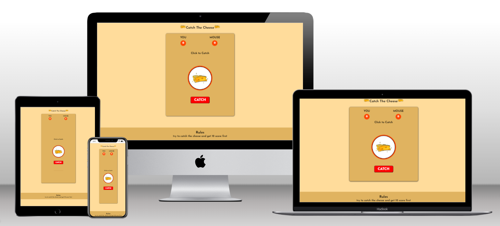

## Introduction

Catch the Cheese is a game to help you to have fun, you will try your luck to catch the cheese aginst the mouse and the game has a truly random result and who will get 10 socre first will win the game.

## Features
#### **header**
The header is featured on the top of the page, shows the game name and before and after the heade we have the cheese logo. the font and the logo are clearly contrasts with the background.

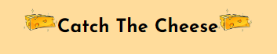

#### **Game area**
in the game area the user will find everything clear and easy.
The Game have 2 stages:
1. start stage: when the player will see the empty scores and the rules and start button.
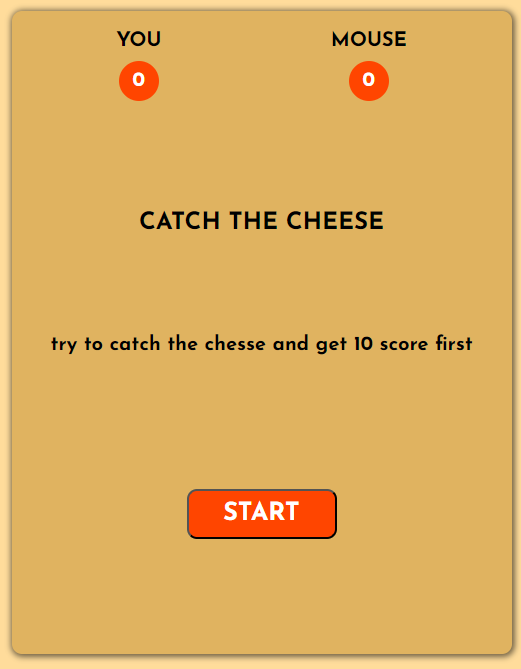

2. playing stage: after the player click start button he will get to the playing stage and the player can find the catch button and above the image of the random choice and a text show the case of win or lose.
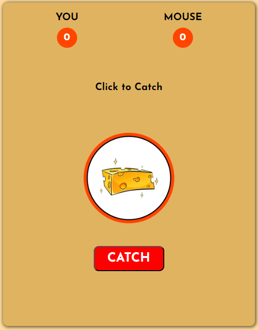

#### **Game results**
- when the user click on the catch button and get the cheese image he will get 1 score.
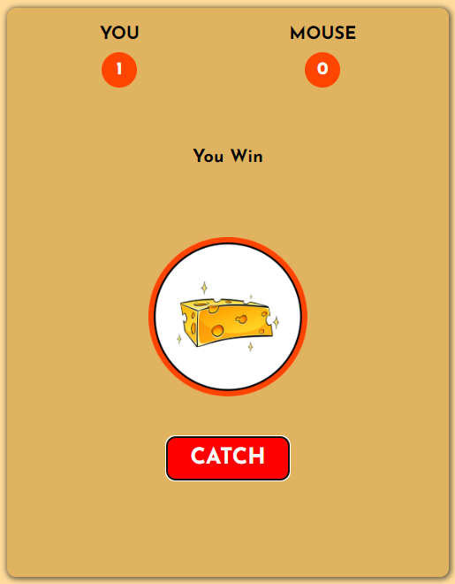

- when the user click on the catch button and get the mouse image the mouse will get 1 score.
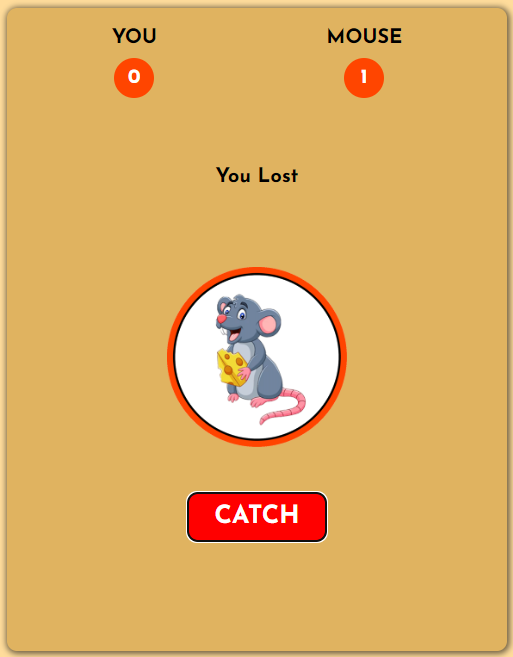

- the winner of the game who will get 10 score first.
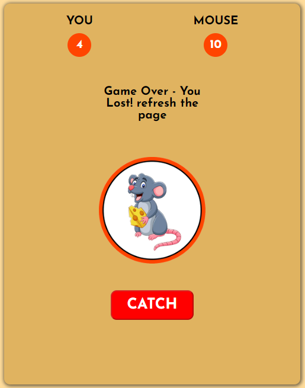

   

#### **Footer**
the footer show the simple rule of the game.

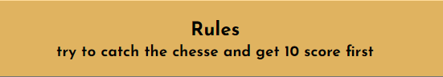

### **Features to Upgrades**
when i have the time, I would like to make animation to show the images shaking each time the player click catch button and  would like to add sfx also. 

### **Testing**

- I tested playing this gamee in different browsers: Chrome, Firefox, Safari.
- I confirmed that the game results are always correct.
- I confirmed that the game's buttons always work as expected.
- I confirmed that the header, instructions, results, footer text, are al readable and easy to understand.
- I confirmed that the colors and fonts chosen are easy to read and accesible by running by running it through lighthouse in devtools. 
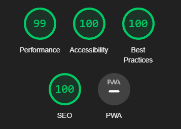
- I confirmed that the project is responsive, looks good and fuctions on all stander screen sizes using the devtools device toolbar.

### **Bugs**
- before I delpoeyd my project to Github i discovered the links to the other files (CSS, JS, Images) was: 
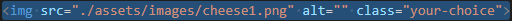
- Bug fixed by editing the lick to be like this : 
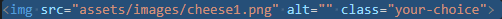

#### **Validator Testing**
- HTML
    - No errors were returned when passing through the official W3C validator.
- CSS
    - No errors were returned when passing through the official (Jigsaw) validator.
- JavaScript

    - No errors were returned when passing the code through the JSHint Evaluation Tool. However, six warning was noted but fixed five warning by using VAR instead of CONST and LST and ignored last one.
 
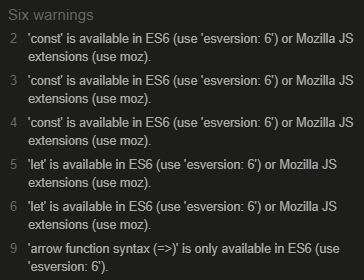

 

## Deployment

* The site was deployed to GitHub pages. The steps to deploy are as follows:
  * In the GitHub repository, navigate to the settings tab.
  * From the source section drop-down menu, select the Master Branch.
  * Once the master branch has been selected, the page provided the link to the completed website.

The Live Link To The Project Can Be Found Here.
[Cathe The Cheese](https://ajoedv.github.io/catch-the-cheese)

## Technologies

- **HTML5** - Used to structure of the site.
- **CSS** - Used to style the site, through a custom made external CSS file.
- **JavaScript** - Used to make the functionality of the game through a custom made external JS file.
- **Adobe Photoshope** - Used to Edite the  photos and the screenshots.
- **Adobe Illustrator** - Used to design the images.
- [Gitpod](https://gitpod.io/) - Used to develop the project
- [GitHub](https://github.com/) - Used to store the code throughout the development
- [W3Schools](https://www.w3schools.com/) - For additional information about HTML and CSS and JS.

### **Content**
- [Code Institute Course](https://codeinstitute.net/) **HTML** Essentials, **CSS** Essentials, **JS** Essentials,   and 'Love maths' project. presented all the knowledge needed to implement this project.

### **Media**
- Cheese and Mouse photos are free images got it from [FreePic Site](https://www.freepik.com) and I edite it on Adobe Photoshop and Adobe Illustrator to get the final result what showing on the game.
- All designs and photos editing operations were done on [Adobe](https://www.adobe.com/)  apps licensed versions.